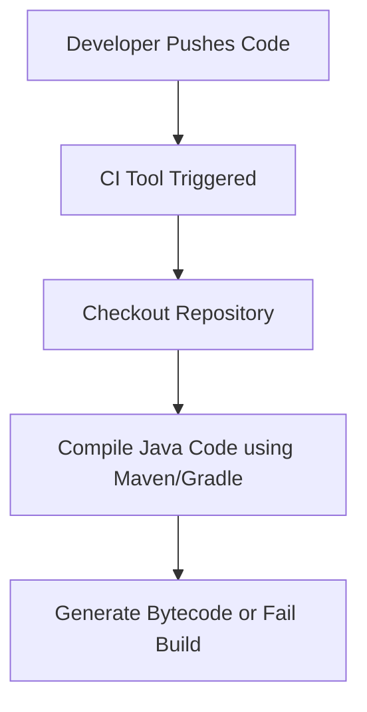

# Java Code Compilation in CI Checks

  

## **Author Information**

|  Version   |   Author     |  Modifed   |      Comment      |    Reviewer      |
|------------|--------------|------------|-------------------|------------------|
|  V1        | Shivani Narula |            | Internal Review   | Siddharth Pawar  |
|  V2        | Shivani Narula  |            | L0 Review         | Naveen Haswani |
|  V3        | Shivani Narula  |            | L1 Review         | Deepak Nishad |
|  V4        | Shivani Narula  |            | L2 Review         | Ashwani Singh |

---

## **Table of Contents**

- [Introduction](#introduction)
- [What?](#what)
- [Why?](#why)
- [CI Workflow Diagram (Code Compilation Phase)](#ci-workflow-diagram-code-compilation-phase)
- [Tools Used for Compilation](#tool-description-why-advantages)
- [Tool Comparison (for Compilation)](#tool-comparison-for-compilation)
- [Advantages of Compilation Step in CI](#advantages-of-compilation-step-in-ci)
- [Disadvantages](#disadvantages)
- [Best Practices](#best-practices)
- [Conclusion](#conclusion)
- [Contact Information](#contact-information)
- [References](#references)

---

## Introduction
This document guides you through the code compilation phase in Java CI pipelines. It explains what compilation is, why it's important, the tools involved, and best practices to follow—with a focus only on the compilation step, not testing or deployment.

---

## What?
**Code compilation** is the process of converting human-readable `.java` source files into `.class` bytecode using the Java compiler (`javac`). In CI, this step validates syntax, resolves dependencies, and prepares the application for further stages like testing and packaging.

---

## Why?
- **Syntax Validation**: Detects issues like missing imports or undeclared variables early.
- **Dependency Management**: Verifies that all required libraries are correctly resolved.
- **Build Assurance**: Ensures that the code can be successfully transformed into an executable format.
- **Fail Fast**: Stops the CI pipeline if code does not compile, saving time and resources.

---

## CI Workflow Diagram (Code Compilation Phase)

---

| Tool       | Description                                                                                                   | Why It's Used                                                                                  | Advantages                                                                          |
| ---------- | ------------------------------------------------------------------------------------------------------------- | ---------------------------------------------------------------------------------------------- | ----------------------------------------------------------------------------------- |
| `javac`    | The basic Java compiler that turns `.java` files into `.class` bytecode.                                      | Used when you want to quickly compile Java code without extra setup.                           | Simple and fast for small projects or quick checks.                                 |
| **Maven**  | A tool that not only compiles code but also manages libraries (dependencies) and organizes the build process. | Used to automate compiling, downloading needed libraries, and managing the build steps easily. | Easy to use with standard project structure and has a large community.              |
| **Gradle** | A newer build tool that compiles code and lets you customize your build process with scripts.                 | Used when you want faster builds and more control over how your code is compiled and packaged. | Builds faster than Maven and is flexible to use with different languages and tasks. |
| **Ant**    | An older build tool where you write scripts to tell it exactly how to compile and build your project.         | Used when you need full control over every step of compilation and building.                   | Very flexible and customizable, but requires more manual setup.                     |

---

## Tool Comparison (for Compilation)
| Tool    | Setup Complexity | Performance | Community Support | Ease of Use in IDE | Customization                                |
| ------- | ---------------- | ----------- | ----------------- | ------------------ | -------------------------------------------- |
| `javac` | Very Low         | Fast        | High              | Fully supported    | Low — just compiles code                     |
| Maven   | Medium           | Moderate    | Very High         | Excellent          | Medium — uses XML for config                 |
| Gradle  | Medium to High   | High        | High              | Excellent          | High — flexible scripting with Groovy/Kotlin |
| Ant     | High             | Moderate    | Medium            | Good               | Very High — full control with XML scripts    |

## Advantages of Compilation Step in CI
| Advantage         | Description                                                      |
| ----------------- | ---------------------------------------------------------------- |
| Quick Feedback    | Shows syntax and structure errors immediately after code push.   |
| Dependency Check  | Detects missing or broken libraries early in the build process.  |
| Build Preparation | Creates compiled files needed for testing and deployment stages. |
| Stops Bad Code    | Prevents code that doesn’t compile from moving forward in CI.    |

## Disadvantages
| Disadvantage          | Description                                                                    |
| --------------------- | ------------------------------------------------------------------------------ |
| Longer Build Time     | Large projects take more time to compile, especially with unnecessary modules. |
| Repeated Compilation  | Without caching, code may compile repeatedly, wasting time.                    |
| Misses Runtime Issues | Compilation can’t detect errors that occur during program execution.           |
| Dependency Problems   | Wrong or missing library versions can cause unexpected failures.               |

## Best Practices
| Best Practice               | Description                                                                        |
| --------------------------- | ---------------------------------------------------------------------------------- |
| Clean Builds                | Use `mvn clean compile` or `gradle clean build` to avoid leftovers causing errors. |
| Modularize                  | Split large projects into smaller modules for faster compilation.                  |
| Use Caching                 | Enable CI caching to avoid recompiling unchanged code.                             |
| Test Multiple Java Versions | Validate code on all supported Java versions (8, 11, 17, etc.).                    |
| Manage Dependencies         | Use tools like Dependabot to keep libraries updated and secure.                    |
| Skip Unnecessary Builds     | Avoid compilation for non-code changes (e.g., documentation).                      |

---

## Conclusion
Maven is the preferred tool for Java code compilation in CI pipelines due to its robust compilation support, comprehensive dependency management, and seamless integration with popular CI platforms like GitHub Actions and Jenkins. Its balance of convention and flexibility makes it ideal for reliable and maintainable build automation.
**Final Tool Choice:** Maven

---
## **Contact Information**

| Name           | Email Address                             |
|----------------|-------------------------------------------|
| Shivani Narula | shivani.narula.snaatak@mygurukulam.co    |

---

| Links                                                                                                      | Descriptions                                       |
| ---------------------------------------------------------------------------------------------------------- | -------------------------------------------------- |
| [Maven Compile Lifecycle](https://maven.apache.org/guides/introduction/introduction-to-the-lifecycle.html) | Official Maven documentation for compile lifecycle |
| [Javac Documentation](https://docs.oracle.com/en/java/javase/17/docs/specs/man/javac.html)                 | Oracle’s official Java compiler documentation      |

