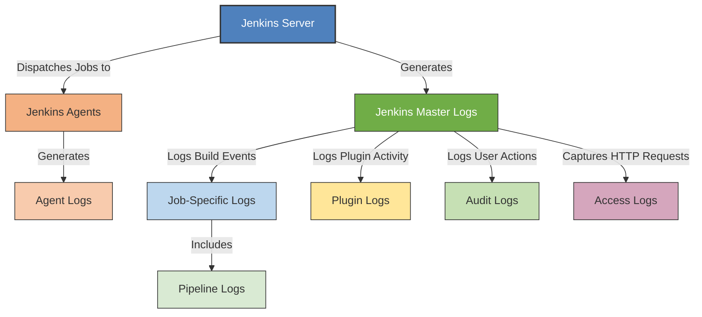

# **Jenkins Log Files**
---

  

## **Author Information**

| Created     | Last updated | Version | Author         | Level | Reviewer        |
|-------------|--------------|---------|----------------|-------|-----------------|
| 25-04-2025  | 02-05-2025    | V1.1  | Shivani Narula  | Internal Review | Siddharth Pawar |

## Table of Contents
- [Purpose](#purpose)  
- [What Are Jenkins Log Files?](#what-are-jenkins-log-files)  
- [Why Are Log Files Important?](#why-are-log-files-important)  
- [Types of Log Files](#types-of-log-files)  
- [Log File Locations](#log-file-locations)  
- [Priority-Based Log Levels](#priority-based-log-levels)  
- [Common Issues and Troubleshooting](#common-issues-and-troubleshooting)  
- [Identify all log files that are generated in Jenkins](#identify-all-log-files-that-are-generated-in-jenkins)  
- [Advantages and Disadvantages](#advantages-and-disadvantages)  
- [Best Practices](#best-practices)  
- [Conclusion](#conclusion)  
- [Contact Information](#contact-information)  
- [References](#references)  

---

## Purpose  
This document details the types, locations, and uses of Jenkins log files. It helps users understand how Jenkins logging works and guides troubleshooting and auditing.

---

## What Are Jenkins Log Files?  
Jenkins logs are system-generated records that capture runtime events, configuration changes, and build activity. These files are instrumental in identifying issues and ensuring smooth CI/CD workflows.

---

## Why Are Log Files Important?  
- **Troubleshooting** – Helps pinpoint the root of failures and unexpected behavior.  
- **Monitoring** – Offers visibility into Jenkins system health and build activity.  
- **Auditing** – Tracks configuration and access changes for compliance purposes.  

---

## Workflow Diagram

## Workflow Diagram Explanation

The workflow diagram illustrates the various types of log files generated and managed by Jenkins components during its operation.

- **Jenkins Server** is the central controller that manages the entire CI/CD process. It performs key roles like generating system-level logs and dispatching jobs to distributed agents.

- **Jenkins Master Logs** capture critical system events such as server startup/shutdown, internal errors, and overall master node operations. These logs are essential for monitoring the health and status of the Jenkins controller.

- The master node dispatches jobs to **Jenkins Agents** , which are separate machines or containers that execute build tasks.

- Each Jenkins Agent produces its own **Agent Logs** that document the build execution and any issues specific to that agent.

- The Jenkins master logs all job-related activities in **Job-Specific Logs**, including detailed outputs from build steps.

- Within these job logs, **Pipeline Logs** track the progress and results of individual stages in a multi-step pipeline, providing fine-grained visibility into the CI/CD workflow.

- Jenkins also maintains **Plugin Logs** to capture events and errors related to various plugins such as Git, Slack notifications, or Email extensions, aiding in troubleshooting plugin-specific problems.

- User interactions with Jenkins, such as configuration changes or login events, are recorded in **Audit Logs**, which support security audits and compliance.

- Finally, HTTP requests coming into the Jenkins server are logged in **Access Logs**. These logs help monitor external access and detect unauthorized attempts.

---

## Types of Log Files  

### 1. Jenkins Master Logs  
Logs generated by the Jenkins controller:  
- `jenkins.log` – Logs startup, shutdown, and internal server errors.  
- `access.log` – Captures HTTP request data for auditing access.  
- `hudson.log` – Provides information on Jenkins’ core operations.  

### 2. Jenkins Agent (Slave) Logs  
Logs from Jenkins distributed build agents:  
- `slave.log` – Tracks job execution and connectivity issues on agent nodes.  
- `agent.log` – Alternative naming convention; logs agent-side activities.  

### 3. Job-Specific Logs  
Logs associated with individual Jenkins jobs:  
- `build.log` – Contains output from build steps, errors, and build status.  
- `consoleText` – UI-accessible plain-text version of the job output.  

### 4. Plugin Logs  
- `plugin-name.log` – Logs specific plugin-related operations and issues.  
- Example plugins: Git plugin, Email Extension, Slack Notifications  
- Location varies: `/var/log/jenkins/`, Jenkins UI → Manage Jenkins → System Log  

### 5. Audit Logs  
- `audit.log` – Records user actions, configuration updates, and security-related events.  
- Enabled via plugins like Audit Trail Plugin and Logstash Plugin  
- Tracks user actions, job updates, credential access, etc.  

---

## Log File Locations  
Jenkins log locations vary by platform and setup:  
- **Linux (Default Location):** `/var/log/jenkins/`  
- **Windows:** `C:\Program Files\Jenkins\logs\`  
- **Custom Location:** Configurable in Jenkins settings or during setup.  

---

## Priority-Based Log Levels  
Logs in Jenkins are prioritized based on severity:

| **Priority**           | **Description**                                  | **Example Logs**                  |
|------------------------|------------------------------------------------|---------------------------------|
| **P0 (Critical Issues)**| Severe failures like system crashes or security violations. | `jenkins.log`, `audit.log`      |
| **P1 (High Priority Issues)** | Issues such as job crashes, plugin failures.          | `build.log`, `plugin-name.log`  |
| **P2 (Medium Priority Issues)**| Warnings and minor issues affecting performance.       | `hudson.log`, `access.log`      |

---

## Common Issues and Troubleshooting  

| **Issue**                  | **Problem**                                     | **Solution**                                                | **Logs to Check**                                         |
|----------------------------|------------------------------------------------|-------------------------------------------------------------|-----------------------------------------------------------|
| Jenkins Not Starting       | Jenkins doesn’t boot.                           | Inspect system logs for config problems or port issues.     | Linux: `/var/log/jenkins/jenkins.log`   Windows: `C:\Program Files (x86)\Jenkins\logs\jenkins.log` |
| Build Failures             | Builds fail mid-execution.                      | Examine build logs for script problems or environment issues.| `$JENKINS_HOME/jobs/{job_name}/builds/{build_number}/log`  |
| High CPU or Memory Usage   | Jenkins slows or hangs.                         | Use logs to identify intensive jobs or misbehaving plugins. | `/var/log/jenkins/jenkins.log`, `$JENKINS_HOME/logs/`      |
| User Authentication Issues | Users can’t log in or get access denied errors.| Check access logs and user settings for misconfiguration.    | `/var/log/jenkins/jenkins.log`, `$JENKINS_HOME/logs/`      |

---

## Identify All Log Files Generated by Jenkins

This section outlines the different types of log files generated by Jenkins, encompassing core system logs, job-specific logs, plugin-related logs, and additional optional configurations. Proper identification and documentation of these logs are essential for effective monitoring and troubleshooting.

### Checklist for Identifying Jenkins Log Files:

- **Core Jenkins System Logs** — e.g., `jenkins.log`, `jenkins.err.log` which record the Jenkins server's internal events and errors.

- **Build Logs** — Located typically at `/var/lib/jenkins/jobs/<job>/builds/<build-number>/log`, capturing console output and build details for individual jobs.

- **Pipeline Logs** — Detailed logs visible in the Jenkins UI for each pipeline stage, providing stepwise execution information.

- **Plugin-Specific Logs** — Logs created by plugins such as Git, Email Extension, Slack Notifications, useful for troubleshooting plugin-related issues.

- **Audit Logs** — Generated when audit plugins (like Audit Trail or Logstash) are enabled, capturing user actions, configuration changes, and security events.

- **Access Logs** — Logs of HTTP requests to Jenkins, often maintained by web servers or reverse proxies such as Nginx or Apache.

- **Log Rotation and Retention Policies** — Configurations applied either within Jenkins or at the OS level to manage log file size and archival.

---

## Advantages and Disadvantages

| **Advantages**                                     | **Disadvantages**                              |
|--------------------------------------------------|------------------------------------------------|
| Centralized logging for all Jenkins components   | Log files can grow very large without rotation |
| Helps with rapid troubleshooting and debugging   | Requires proper permissions to secure sensitive data |
| Enables auditing and compliance tracking         | Logs may contain sensitive info if not masked  |
| Supports plugin-specific log details              | Multiple log locations can cause confusion     |
| Integration with external tools (Logstash, Splunk)| Overhead on storage and processing if not managed properly |

---

## Best Practices  
- **Regular Review** – Schedule periodic log reviews to catch problems early.  
- **Log Retention Policies** – Set limits on log history to avoid storage bloat.  
- **Access Control** – Restrict access to sensitive log files to admin users.  

---

## Conclusion  
Jenkins logs are fundamental to maintaining a secure, efficient, and resilient CI/CD environment. Familiarity with log types, locations, and analysis practices enables proactive system maintenance and rapid issue resolution.

---

## **Contact Information**

| Name           | Email Address                             |
|----------------|-------------------------------------------|
| Shivani Narula   | shivani.narula.snaatak@mygurukulam.co       |

---

## References  

| Links                                      | Descriptions                 |  
|--------------------------------------------|-----------------------------|  
| [Jenkins Documentation](https://www.jenkins.io/doc/) | Official Jenkins Documentation |  
| [Jenkins Log Locations](https://www.jenkins.io/doc/book/system-administration/viewing-logs/) | Guide to Jenkins Log Locations |
