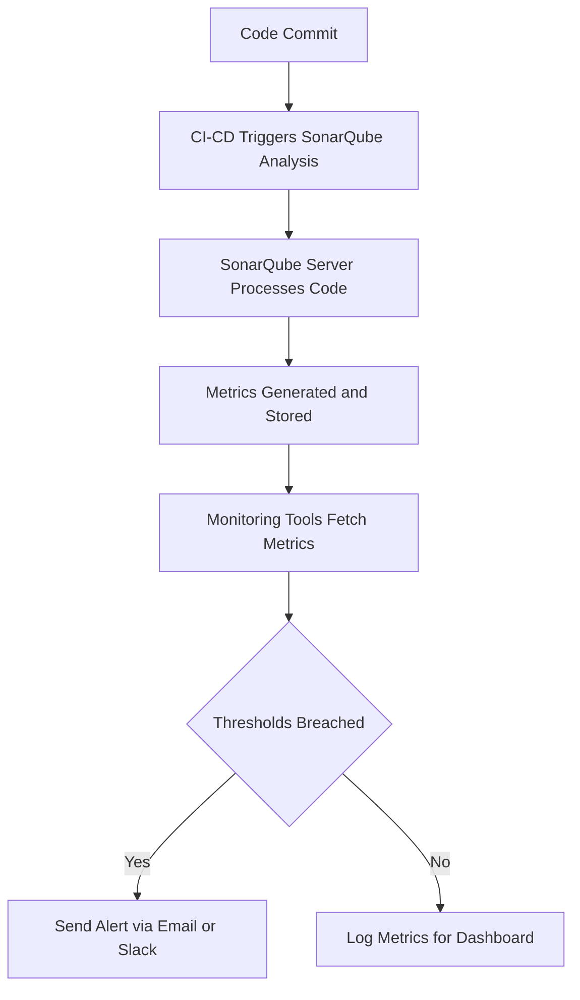

# SonarQube Metrics to Monitor

  

## **Author Information**

| Created     | Last updated | Version | Author         | Level | Reviewer        |
|-------------|--------------|---------|----------------|-------|-----------------|
| 15-05-2025  |     | V1  | Shivani Narula  | Internal Review | Siddharth Pawar |

## Table of Contents
- [Introduction](#introduction)
- [What Does It Mean to Monitor SonarQube Metrics?](#what-does-it-mean-to-monitor-sonarqube-metrics)
- [Why Monitor SonarQube Metrics?](#why-monitor-sonarqube-metrics)
- [Workflow Diagram](#workflow-diagram)
- [Key Metrics to Monitor](#key-metrics-to-monitor)
    - [Metrics Classified According to Priority](#metrics-classified-according-to-priority)
    - [Accessing Project Metrics in SonarQube](#accessing-project-metrics-in-sonarqube)
- [Recommended Thresholds & Alerts](#recommended-thresholds--alerts)
- [Advantages & Disadvantages](#advantages--disadvantages)
- [Best Practices for Monitoring SonarQube Metrics](#best-practices-for-monitoring-sonarqube-metrics)
- [Conclusion](#conclusion)
- [Contact Information](#contact-information)
- [Reference Table](#reference-table)

---

## Introduction

This document outlines the value of tracking SonarQube metrics. It highlights their role, pros and cons, and optimal usage practices. 

---

## What Does It Mean to Monitor SonarQube Metrics?
Monitoring SonarQube metrics means regularly checking the numbers and reports that SonarQube creates when it analyzes your code. These include things like bugs, security problems, test coverage, repeated code, and how much work is needed to fix issues. By watching these metrics, teams can understand how healthy the code is, find problems early, and keep the code clean and safe according to standards.

---

## Why Monitor SonarQube Metrics?

- Ensure high availability for developers and pipelines  
- Detect and resolve performance bottlenecks early  
- Maintain code quality and security feedback loops  
- Monitor trends in technical debt and vulnerabilities  
- Proactively alert on threshold violations (e.g., slow response time, heap memory overuse)

---
## **Workflow Diagram**

### Step-by-Step Workflow Overview

This flow describes how SonarQube metrics are collected, analyzed, and monitored for quality thresholds.

#### 1. Code Commit
Developer pushes code to a VCS (GitHub, GitLab, Bitbucket, etc.).

#### 2. CI/CD Triggers SonarQube Analysis
CI/CD pipeline (Jenkins, GitHub Actions, GitLab CI) triggers SonarQube analysis.

#### 3. SonarQube Server Processes Code
Scans for:
- Bugs
- Vulnerabilities
- Code Smells
- Test Coverage
- Duplications
- Complexity

#### 4. Metrics Generated and Stored
SonarQube generates metrics and stores them in its database.

#### 5. Monitoring Tools Fetch Metrics
Monitoring systems (e.g., Prometheus, Grafana) fetch metrics to track trends.

#### 6. Thresholds Breached? (Decision Point)
System checks predefined thresholds like:
- Bugs > 0
- Coverage < 80%
- Duplications > 5%

**➤ If Thresholds Are Breached**  
Action:  
- Send alerts via email, Slack, etc.

**➤ If Thresholds Are Not Breached**  
Action:  
- Metrics logged for dashboard visualization; no alert sent.

---

## Key Metrics to Monitor

| Category       | Metric                 | Description                                      |
|----------------|------------------------|--------------------------------------------------|
| Code Quality   | Bugs                   | Total number of code-level errors                |
|                | Vulnerabilities        | Security risks within the codebase               |
|                | Code Smells            | Maintainability issues                           |
| Coverage       | Coverage               | Code coverage by automated tests                 |
|                | Lines to Cover         | Total lines expected to be tested                |
|                | Uncovered Lines        | Untested lines                                   |
| Duplications   | Duplicated Lines (%)   | Percentage of duplicated code                    |
|                | Duplicated Blocks      | Blocks of repeated code                          |
|                | Duplicated Files       | Files with duplication                           |
| Size           | Lines of Code (LOC)    | Total analyzed lines                             |
|                | Statements             | Number of statements                             |
|                | Classes                | Number of classes                                |
|                | Functions              | Total functions/methods                          |
|                | Files                  | Total files                                      |
| Complexity     | Cognitive Complexity   | Code understandability                           |
|                | Cyclomatic Complexity  | Logical complexity/path count                    |
| Issues         | Blocker Issues         | Critical issues needing immediate attention      |
|                | Critical Issues        | High-impact problems                             |
|                | Major Issues           | Significant but not blocking                     |
|                | Minor Issues           | Low-severity issues                              |
|                | Info Issues            | Informational messages                           |
| Security       | Security Hotspots      | Code needing manual review for security          |
|                | Security Rating        | Grade A–E based on vulnerabilities                |
| Maintainability| Maintainability Rating | Grade A–E for maintainability                    |
| Reliability    | Reliability Rating     | Grade A–E for reliability                        |
| Technical Debt | Technical Debt         | Time to resolve maintainability issues           |
| Compliance     | Rules Compliance       | Adherence to coding rules                        |

---

### Metrics Classified According to Priority

| Priority | Metrics                             | Description                                               |
|----------|--------------------------------------|-----------------------------------------------------------|
| P1       | Bugs, Vulnerabilities, Coverage      | Critical to security and stability                        |
| P2       | Technical Debt, Duplications, Maintainability | Boosts long-term maintainability                  |
| P3       | Code Smells, Complexity              | Improves developer productivity and readability           |

---

### Accessing Project Metrics in SonarQube

1. Open the project in the SonarQube dashboard.  
2. Click the **"Measures"** tab.  
3. Explore categorized breakdowns of all tracked metrics.

---

### Recommended Thresholds & Alerts

| Metric                    | Threshold                     | Action                                      |
|---------------------------|-------------------------------|---------------------------------------------|
| CPU Usage                 | > 80%                         | Alert & investigate load spikes             |
| Heap Memory Usage         | > 75%                         | Tune GC or increase heap                    |
| API Response Time         | > 500ms                       | Investigate performance issues              |
| Background Task Failures  | > 0 (critical tasks)          | Immediate alert and review                  |
| Bugs / Vulnerabilities    | Any new critical/blocker      | Notify DevSecOps or Engineering teams       |
| Coverage                  | < 80%                         | Alert development teams                     |
| DB Connection Usage       | > 90% of connection pool      | Tune or scale database                      |

---

## Advantages & Disadvantages

| Pros                          | Cons                                                            |
|-------------------------------|-----------------------------------------------------------------|
| Promotes cleaner code         | Adds overhead to development/CI/CD                             |
| Detects issues proactively    | May produce false positives or strict reports                  |
| Aids technical decisions      | Too many metrics may complicate decision-making                |
| Improves team collaboration   | SonarQube outages may block releases                           |

---

## Best Practices for Monitoring SonarQube Metrics

| Practice             | Benefit                                                           |
|----------------------|-------------------------------------------------------------------|
| Regular Inspections  | Prevents regression and maintains quality                        |
| Define Thresholds    | Helps make decisions based on measurable data                   |
| Setup Alerts         | Enables quick response to emerging issues                       |
| CI/CD Integration    | Ensures every code change is analyzed                           |
| Educate Developers   | Builds ownership and code quality awareness                     |
| Periodic Reviews     | Adapts monitoring as project complexity changes                 |

---

## Conclusion

Consistent monitoring of SonarQube metrics empowers teams to develop secure, maintainable, and high-quality software. With defined thresholds, alerting, and integration in CI/CD, SonarQube becomes an essential tool for continuous improvement.

---

## **Contact Information**

| Name           | Email Address                             |
|----------------|-------------------------------------------|
| Shivani Narula   | shivani.narula.snaatak@mygurukulam.co       |

---

## **Reference Table**

| **Link**                                                                                                                     | **Description**                                    |
|-----------------------------------------------------------------------------------------------------------------------------|--------------------------------------------------|
| [SonarQube Documentation](https://docs.sonarsource.com/sonarqube-server/10.7/user-guide/code-metrics/metrics-definition/) | SonarQube Metric Definitions    |
