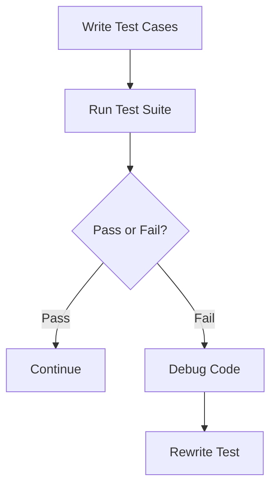

# Unit Testing in Python

  

## **Author Information**

|  Version   |   Author     |  Modified   |      Comment      |    Reviewer      |
|------------|--------------|------------|-------------------|------------------|
|  V1        | Shivani Narula |            | Internal Review   | Siddharth Pawar  |
|  V2        | Shivani Narula  |            | L0 Review         | Naveen Haswani |
|  V3        | Shivani Narula  |            | L1 Review         | Deepak Nishad |
|  V4        | Shivani Narula  |            | L2 Review         | Ashwani Singh |

## Purpose
The purpose of this document is to provide a comprehensive overview of Python Unit Testing, including its importance, tools available, best practices, and recommendations for efficient compilation processes.

## Table of Contents

- [Introduction](#introduction)
- [What?](#what)
- [Why?](#why)
- [Workflow Diagram](#workflow-diagram)
- [Different Tools for Unit Testing in Python](#different-tools-for-unit-testing-in-python)
- [Comparison of Tools](#comparison-of-tools)
- [Advantages](#advantages-of-unit-testing)
- [Disadvantages](#disadvantages-of-unit-testing)
- [Best Practices](#best-practices)
- [Recommendation](#recommendation)
- [Conclusion](#conclusion)
- [Contact Information](#contact-information)
- [References](#references)

## Introduction
This document explains the basics of Python unit testing, covering key concepts, popular tools, best practices, and recommendations. It aims to help developers write effective tests to improve code quality and reliability.

---

## What?
Unit testing refers to the process of writing and running small tests that check the correctness of individual parts (units) of a program, usually at the function level.

---

## Why?
- Ensures individual code blocks work as intended.
- Makes future code changes safer and more reliable..
- Helps find bugs early in development.
- Promotes modular, maintainable code.

---

## Workflow Diagram

### Explanation
| **Step**         | **Description**                                                  | **Example**                                                                   |
| ---------------- | ---------------------------------------------------------------- | ----------------------------------------------------------------------------- |
| Write Test Cases | Write code to test individual units or functions.                | Write a test for a function that adds two numbers: `assert add(2,3) == 5`     |
| Run Test Suite   | Execute all test cases to check if the code behaves as expected. | Run `pytest` or `python -m unittest` to run all tests.                        |
| Pass or Fail?    | Check if tests passed or failed.                                 | If the addition test passes, move forward; if it fails, proceed to debugging. |
| Continue         | If tests pass, continue development or deployment.               | Merge code to main branch or deploy to production.                            |
| Debug Code       | Investigate and fix the code causing test failures.              | Find out why `add(2,3)` returned `4` instead of `5`.                          |
| Rewrite Test     | Modify or add new tests if needed after fixing the code.         | Adjust the test if the function signature changed or add edge cases.          |

---

## **Different Tools for Unit Testing in Python**

| **Tool**  |  **Description**                                                  | **Why It's Used**                                                                      |  **Advantages**                                                                 |
| ------------ | ------------------------------------------------------------------- | ---------------------------------------------------------------------------------------- | -------------------------------------------------------------------------------- |
| `unittest`   | Built-in module inspired by Java’s JUnit.                           | Used when you want a standard, built-in solution for writing and running tests.          | No external installation needed; integrates well with Python’s standard library. |
| `pytest`     | Powerful, easy-to-use framework with a rich plugin ecosystem.       | Used for writing concise tests with advanced features like fixtures and parametrization. | Cleaner syntax, better output, supports plugins and complex test scenarios.      |
| `nose2`      | Successor of `nose`, extends `unittest` functionality.              | Used when migrating from `nose` or extending `unittest`-based test suites.               | Auto test discovery, compatible with `unittest`.                                 |
| `doctest`    | Allows writing tests inside docstrings that validate documentation. | Used when you want to ensure your code examples in docs actually work.                   | Great for documentation testing, minimal setup.                                  |
| `hypothesis` | Property-based testing tool that generates test cases dynamically.  | Used to find edge cases by automatically creating a wide range of inputs.                | Detects unexpected bugs, supports generative testing.                            |

---

## Comparison of Tools

| Feature           | unittest                                                    | pytest                                                               | nose2                                              | doctest                                                       | hypothesis                                                           |
| ----------------- | ----------------------------------------------------------- | -------------------------------------------------------------------- | -------------------------------------------------- | ------------------------------------------------------------- | -------------------------------------------------------------------- |
| Built-in          | Included in Python standard library, no installation needed | Requires installation as an external package                         | Requires installation, successor of nose           | Included in Python standard library, no installation needed   | Requires installation as an external package                         |
| Plugins Support   | Very limited, no plugin ecosystem                           | Extensive plugin ecosystem with many available plugins               | Supports plugins, compatible with unittest plugins | No plugin support                                             | Supports plugins, integrates with other tools                        |
| Easy Syntax       | Moderate complexity, verbose compared to others             | Very easy and expressive syntax for writing tests                    | Easier than unittest, similar syntax               | Very simple, tests written inside docstrings                  | Easy syntax, uses decorators for test generation                     |
| Advanced Features | Basic assertions and test suites                            | Rich features like fixtures, parametrization, and detailed reporting | Basic features, extends unittest functionality     | Minimal features, mainly for documentation tests              | Property-based testing with automated input generation               |
| Auto Discovery    | Requires manual test suite definition                       | Automatically discovers tests in files and directories               | Automatically discovers tests                      | No automatic discovery, tests run only when explicitly called | No automatic discovery, depends on integration with other frameworks |

---

## Advantages of Unit Testing

| **Advantage**          | **Description**                                    |
| ---------------------- | -------------------------------------------------- |
| Early Bug Detection    | Helps catch issues early during development        |
| Code Quality           | Improves overall code structure and reusability    |
| Refactoring Safety     | Ensures changes don’t break existing functionality |
| Documentation          | Acts as live documentation for code behavior       |
| Integration with CI/CD | Seamlessly fits into automated pipelines           |

---

## Disadvantages of Unit Testing
| **Disadvantage**                       | **Description**                                                    |
| -------------------------------------- | ------------------------------------------------------------------ |
| Time-Consuming                         | Writing comprehensive tests requires significant time and planning |
| False Sense of Security                | Tests may pass even if logic is flawed (if test cases are weak)    |
| Maintenance Overhead                   | Updating tests when logic changes can be cumbersome                |
| Not a Substitute for Integration Tests | Unit tests alone can’t catch all system-level issues               |

---

## Tool-wise Advantages and Disadvantages of Unit Testing
| Tool         | Advantages                                                                                                    | Disadvantages                                                                              |
| ------------ | ------------------------------------------------------------------------------------------------------------- | ------------------------------------------------------------------------------------------ |
| `unittest`   | - Built-in, no install - Stable and widely known - Supports test organization via classes               | - Verbose syntax - Limited features - Manual test discovery                          |
| `pytest`     | - Concise and readable syntax - Auto test discovery - Rich plugin ecosystem - Detailed reporting     | - External dependency - Learning curve for advanced features                            |
| `nose2`      | - Auto discovery - Extends unittest features - Easier transition from unittest/nose                     | - Smaller community - Limited plugins - Needs installation                           |
| `doctest`    | - Minimal setup - Live documentation - Useful for simple tests                                          | - Limited testing scope - No auto discovery - Not for complex tests                  |
| `hypothesis` | - Finds edge cases automatically - Powerful for property-based tests - Integrates with other frameworks | - Steeper learning curve - External install - Debugging test failures can be complex |

---

## Best Practices

| Best Practice                        | Explanation                                                                 |
|--------------------------------------|------------------------------------------------------------------------------|
| Keep Tests Independent               | Each test should run in isolation                                           |
| Use Meaningful Names                 | Test method names should reflect their purpose                              |
| Focus on One Scenario per Test       | One test should validate one behavior only                                  |
| Automate Test Execution              | Integrate tests with CI tools like Jenkins, GitHub Actions                  |
| Use Mocks and Fixtures Wisely        | Avoid external dependencies during testing                                  |
| Aim for High Coverage, but Smartly   | Coverage is useful, but focus on quality of tests over quantity             |

---

## Recommendation
We recommend using **pytest** as the primary tool for Python unit testing because it is modern, simple to use, and integrates well with CI/CD workflows.

|  **Reason**                   |  **pytest Advantage**                                       |
|--------------------------------|----------------------------------------------------------------|
| **Easy to Use**                | Simple syntax and minimal boilerplate                          |
| **Readable Output**            | Clear test failure messages and tracebacks                     |
| **Powerful Plugin System**     | Extendable via a rich ecosystem of plugins                     |
| **CI/CD Friendly**             | Seamless integration with Jenkins, GitHub Actions, etc.        |
| **Supports Fixtures and Parametrize** | Advanced features for efficient and reusable test cases      |

---

## **Unit Testing POC**

Refer to this link for [**"Step-by-Step Instructions"**]() for Unit testing in Python CI workflows.

---

## Conclusion
Unit testing is a crucial part of the software development lifecycle that helps ensure the reliability and maintainability of code. When done correctly using appropriate tools and practices, it leads to faster development, fewer bugs, and cleaner code.

---

## **Contact Information**

| Name           | Email Address                             |
|----------------|-------------------------------------------|
| Shivani Narula | shivani.narula.snaatak@mygurukulam.co    |

---
## References
| **Links**                                                                        | **Descriptions**                                                  |
| -------------------------------------------------------------------------------- | ----------------------------------------------------------------- |
| [Python unittest Documentation](https://docs.python.org/3/library/unittest.html) | Official documentation for Python’s built-in unittest framework.  |
| [Keploy Blog](https://keploy.io/blog)                                            | Blog with articles on testing and test automation best practices. |
